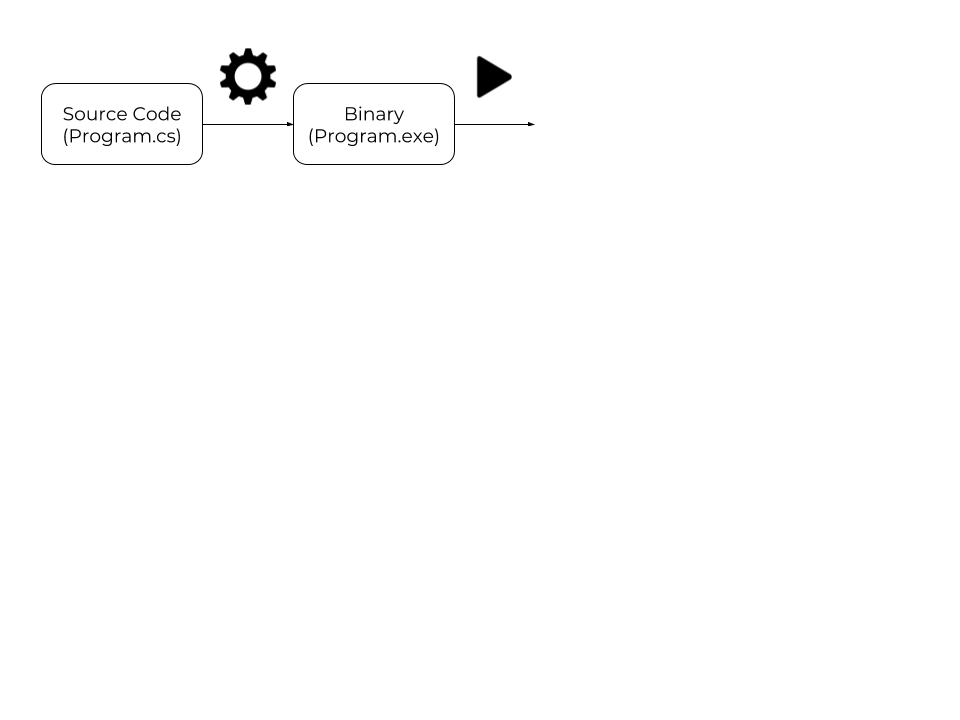
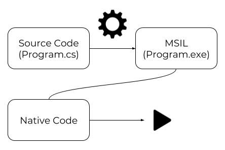

\titlepage

## Overview
\tableofcontents

# Introduction

## Quick characteristics

> - Multi-paradigm (mostly object oriented)
> - Strong typing
> - Developped by Microsoft
> - Strongly inspired by Java and C++

# History

## Origin

> - Created for .NET framework as a replacement for `SMC`
> - January 1999: Anders Hejlsberg forms a team to build a new language
> - July 2000: Public annoucement of .NET and C# during the Professional Developpers Conference

## Versions

| C# version | Release date  | Adding                                        |
|------------|---------------|-----------------------------------------------|
| 1.0        | January 2002  | Lot of things                                 |
| 2.0        | June 2006     | `static`, `null`, generics, delegates         |
| 3.0        | November 2007 | `var`, automatic properties, initializers     |
| 4.0        | April 2010    | Optional parameters                           |
| 5.0        | August 2012   | Not so much                                   |
| 6.0        | July 2015     | String interpolation, Dictionnary initializer |
| 7.0        | March 2017    | Local functions                               |

## Name

> - Originally named `Cool` (C-like Object Oriented Language)
> - Musical notation: semitone higher in pitch
> - `C` => `C++` => `C++++`

# Compilation

## Classic compilation

A classic compilation diagram would look like this :



## C# compilation



## What's the difference ?

> - C# uses an intermediate language named `MSIL`
> - The MSIL generated code is named "Assembly"
> - This code is compiled using JIT (Just In Time compiler)
> - The final is a binary program (machine language)

## .NET

> - Developed by Microsoft
> - Software Framework
> - Includes large class library (FCL)
> - Language interoperability
> - Open sources

# Syntax

## Types initialization

> - Undeclared
> - `<type> <name>;`
> - Declared but still uninitialized
> - `<name> = <value>;`
> - Initialized

## Types initialization

> - Undeclared
> - `<type> <name> = <value>;`
> - Initialized

## Arrays

```cs
<type>[] <name>;
<type>[] <name> = <variable>;
<type>[] <name> = new <type>[size];
```

## Initialization - Examples

```cs
char dab = '\t';
int theAnswer = 42;
float goldRatio = 1.6180f;
string deadLine = "These violent deadlines have
                   violent ends";
bool youAreCheaters = true;

int[] randomArray = new int[10];
int[] fibonacci = { 0, 1, 1, 2, 3, 5, 8, 13, 21 };
```

## Operators

> - `+(=)`
> - `++`
> - `-(=)`
> - `--`
> - `*(=)`
> - `/(=)`
> - `%(=)`

## Comparison operators

> - `==`
> - `!=`
> - `<(=)`
> - `>(=)`

## Examples

```cs
int theAnswer = 2 * 4 + 2;
// theAnswer = 10
theAnswer *= 4;
// theAnswer = 40
theAnswer += 2;
// theAnswer = 42
bool isTheAnswer = theAnswer == 42;
// isTheAnswer = true
bool isEven = theAnswer % 2 == 0;
// isEven = true
```

## Logical operators

> - `&&`
> - `||`

## Bitwise operators

> - '!'
> - `&(=)`
> - `|(=)`
> - `^(=)`
> - `<<(=)`
> - `>>(=)`

## Exemples

```cs
int[] fibonacci = { 0, 1, 1, 2, 3, 5, 8, 13, 21 };
// fibonacci = { 0, 1, 1, 2, 3, 5, 8, 13, 21 }
bool randomTest = (fibonacci[2] + fibonacci[5]) == 6
                  && fibonacci[0] == fibonacci[1];
// randomTest = false
int pow_two = 1;
// base 2 : pow_two = 000000001
// pow_two = 1
pow_two <<= 6;
// base 2 : pow_two = 001000000
// pow_two = 64
pow_two ^= 96;
// base 2 : pow_two = 000100000
// pow_two = 32
```

## Warning !

```cs
int foo = 6;
int bar = foo;
bar = 25
```
> - What is the value of foo ?
> - 6

## Warning !

```cs
int[] foo = { 20, 20 };
int[] bar = foo;
bar[0] = 19;
foo[1] = 97;
```

> - What is the value of foo ?
> - { 19, 97 }

## Functions

```cs
<type> <functionName>(<type1> <argName1>, <type2> <argName2>,
                      ...)
{
  //Do things
  return <value of type <type>>
}
```

## Functions - Examples

```cs
string bridge()
{
  return "You fools !";
}

void happyBirthday(string name, int age)
{
  Console.WriteLine("Happy Birthday " + name +
                    " ! You are " + age + " years old now !");
}
```

> - Why happyBirthDay has void as a return type ?
> - It writes the string into the console.

## Functions calls

```cs
string fly = bridge();
// fly = "You fools !"
happyBirthday("Cyril", 22);
Happy Birthday Cyril ! You are 22 years old now !"
```

## Arguments passed by reference

```cs
<type> <functionName>(ref <type1> <argName1>,
                      ref <type2> <argName2>, ...)
{
  //Do things
  return <value of type <type>>
}
```

## Arguments passed by reference - Examples

```cs
void setValue(ref int x, int y, int i, int j)
{
  x = i;
  y = j;
}
```

> - What will be the value inside and outside the function ?

## Functions calls

```cs
int x = 0;
int y = 0;
setValue(ref x, y, 36, 30);
setValue(ref x, 30, 36, y);
setValue(ref 10, 14, 36, 30);
```

> - What is the value of x and y after the first call ?
> - x = 36 and y = 0
> - What is the value of x and y after the second call ?
> - x = 36 and y = 0
> - What is the value of x and y after the third call ?
> - There is an error

# Questions ?

# Imperative programming

## What is imperative?

> - You do what I want
> - Do my exam
> - If I'm tired make me sleep
> - While I sleep clean my dishes

## Control structures - if

```cs
if (<condition1>)
{
  // <condition1> is true
}
else if (<condition2>) // Optional
{
  // <condition1> is false and <condition2> is true
}
else // Optional
{
  // <condition1> and <condition2> are false
}
```

## Examples - if

```cs
int promo = ...;
bool acdcu = ...;
if (promo == 2020 && acdcu)
{
  Console.WriteLine("Hi ! I'm Ferdinand !");
}
else if (promo == 2020 && !acdcu)
{
  Console.WriteLine("Hello ! I'm your ACDC !");
}
else
{
  Console.WriteLine("I'm still too young :'( !");
}
```

## Control structures - ternary

```cs
<condition1> ? /* condition1 is true */
             : /* condition1 is false*/;
```

> - ? is the if
> - : is the else
> - How can we do a if else \<condition2> ?
> -   \<condition1> ? /* \<condition1> is true*/
                        : \<condition2> ? /* <condition1> is
                        false and <condition2> is true */
                        : /* <contition1> and <condition2>
                        are false*/;
> - usefull to shorten your code

## Examples - ternary

```cs
int n = ...;
int abs = n >= 0 ? n : 0;
```

> - What is the value of abs ?
> - if n is negative abs is null else it's n

## Control structures - switch

```cs
switch (<variable>)
{
  case <case1>:
    // <variable> == <case1>
    break;
  case <case2>:
    // <variable> == <case2>
    break;
  case :
    // <variable> is does not match to <case1> or <case2>
    break;
}
```

## Examples - switch

```cs
string girl_name = ...;
switch (name)
{
  case "no name":
    Console.WriteLine("A girl has no name");
    break;
  case :
    Console.WriteLine("You are not ready " + name);
    break;
}
```

## Control structures - while & do while

```cs
while (<condition>)
{
  // loop until <condition> is false
}

do {
  // do this then test the condition
  // and loop if <condition> is true
} while (<condition>);
```

## Examples - while & do while

```cs
bool found_charlie = false;
while (!found_charlie)
{
  Console.WriteLine("Where is Charlie ?");
  found_charlie = find_location();
}
Console.WriteLine("Yes ! Charlie is in the kitchen !");
```

## Examples - while & do while

```cs
bool found_charlie = false;
do {
  Console.WriteLine("Where is Charlie ?");
  found_charlie = find_location();
} while (!found_charlie);
Console.WriteLine("Yes ! Charlie is in the kitchen !");
```

> - What is the difference between the two loops ?
> - While test first the condition wheras
    do while first execute body

## Control structures - for

```cs
for (<initial>; <condition>; <instruction>)
{
  // loop until <condition> is false
  // and execute <instruction> after a loop
}
```

## Examples - for

```cs
int n = 0;
for (int i = 0; i < 100; ++i)
{
  n += i;
}
// n = 5050
```

## Control structures - foreach

```cs
foreach (<type> <name> in <collection>)
{
  // loop in the entire <collection>
}
```

## Examples - foreach

```cs
string[] names = { "Inaxys", "CueBrick", "Tetra" };
foreach (string name in names)
{
  Console.WriteLine(name + " is in the place !");
}
```

> - Can we modify the variable in a foreach loop ?
> - Never do this

# Questions ?

# Object Oriented Programming

## What is OOP?

* A concept
* Patterns
* Create 'objects' from the patterns
* Object interaction

## A class

```cs
class ACDC
{
  //fields
  float _height;
  float _weight;
  bool _isMean;
  [...]
}
```

## A class with methods

```cs
class Student
{
  // fields
  string _name;
  float _height;
  float _weight;
  bool _isMean;
  Color _hairColor;

  // methods
  string GetName();
  void GoToClass();
  bool IsInClass();
  void Work();
}
```

## Example of using methods

```cs
public static void Main(string[] args)
{
  Student student = new Student();

  if (! student.IsInClass())
    student.GoToClass();
  else
    student.Work();
}
```

## Instantiating an object

* Instantiating is 'creating'
* the keyword: **new**
* the class constructor: a special method

## Constructor

* what is it?
* instanciate an object
* you can have several constructor per class
* there is a default one if none is given
* initialize the fields

## Example

```cs
class ACDC
{
  // fields
  string _name;
  int _height;
  int _age;
  [...]

  // method
  void AnswerQuestion();
  void Facepalm();
  [...]
}
```

## Example
```cs
class ACDC
{
  public ACDC()
  {
    this._name = "Cyril";
    this._height = 180;
    this._age = 2;
  }

  public ACDC(string name, int height, int age)
  {
    this._name = name;
    this._height = height;
    this._age = age;
  }
}
```

## Example

```cs
public static void Main(string[] args)
{
  ACDC cyril = new ACDC();
  ACDC cuebrick = new ACDC("Cuebrick", 280, 20);

  cyril.GetAge(); // returns 2
  cuebrick.GetAge(); // return 20
}
```

## Static fields

* Common to every instance of a class
* Cannot be accessed from instance
* Cannot be accessed with **this**.

##  Static Class

* Cannot be instantiated
* Every field is static

## Example

```cs
class ACDC
{
  public static int count;
  public ACDC()
  {
    ++count;
  }

  [...]
}
```

## Example

```cs
public static void Main(string[] args)
{
  ACDC garage = new ACDC();
  ACDC kirzie = new ACDC();

  ACDC.count; // count = 2;
}
```

# Visibility

# Inheritance

## Concept

> - Classes can inherit properties of other classes
> - The class that inherits is called "Child class"
> - The class from which the "Child class" inherits is called "Parent class"
> - Child classes can implement additionnal properties
> - Allows us to create a tree with our classes

## Visual example


## In Code

```cs
class Assistant
{
  public string nickname;

  public Assistant(string nickname)
  {
    this.nickname = nickname;
  }
}
```

# In Code

```cs
class ACDC : Assistant
{
  public ACDC(string nickname): base(nickname)
  {
    /* No need to initialize this.nickname */
  }

  public void TeachCAML()
  {
    /* CAML magic */
  }
}
```

# Advanced C#

## Keywords

* `var`
* `typeof`
* and a lot more (`yield`, `explicit`, `try`, `unsafe`, `using`)

# var

```cs
ACDC acdc = new ACDC();
// is the same thing as
var acdc = new ACDC();
```

# var and null

```cs
var tetra = new ACDC();
tetra = null;

ACDC tetra = new ACDC();
tetra = null;

var tetra = null; // compilation failed
```

# typeof

```cs
```

