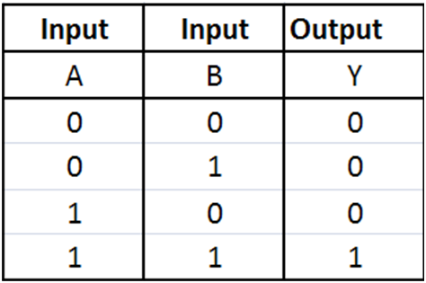
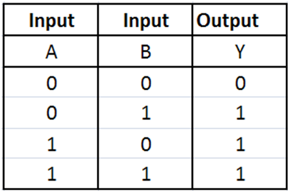
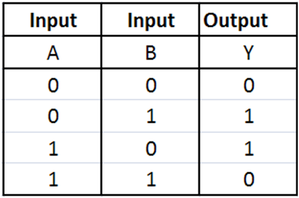

\titlepage

## Overview
\tableofcontents

# Introduction

## C# characteristics

> - Multi-paradigm (mostly object oriented)
> - Strong typing
> - Developped by Microsoft
> - Strongly inspired by Java and C++

## Code example

### Java Hello World
```java
public class HelloWorld {
  public static void main(String[] args) {
    System.out.println("Hello world!");
  }
}
```

### C# Hello World
```cs
using System;

public class HelloWorld {
  public static void Main() {
    Console.WriteLine("Hello World!");
  }
}
```

## Name

> - Originally named `Cool` (C-like Object Oriented Language)
> - Musical notation: semitone higher in pitch
> - `C` => `C++` => `C++++`

## Compilation 101

> - The computer works with its own language (Machine language)
> - We need to translate our source code into machine language
> - This is called **compilation**
> - Compiler: program of translation
> - Called once for many executions

## Compilation 101


(Almost)

## .NET

> - Developed by Microsoft
> - Software Framework
> - Language interoperability
> - Open source
> - A set of APIs

# Syntax

## Types initialization

> - `int theAnswer = 42;`{.cs}
> - theAnswer is an integer, and equals 42
> - `int theAnswer;`{.cs}
> - theAnswer is an integer, and equals 0 (default value)


## Initialization - Examples

> - `char nine = '9';`{.cs}
> - `char nineAlso = 57;`{.cs}
> - `float goldenRatio = 1.6180f;`{.cs}
> - `string deadLine = "These violent deadlines"`{.cs}
                      ` + "have violent ends";`{.cs}
> - `bool youAreInEpita = true;`{.cs}

> - `float[] floatArray = new float[10];`{.cs}
> - `string[] names = { "LordPatate", "Fuizziy", "Nicolas" };`{.cs}

## Warning!

```cs
int foo = 6;
int bar = foo;
bar = 25;
```
> - What is the value of foo?
> - 6

> - What is the value of bar?
> - 25

## Comments

> - What are comments?
> - Is it eatable?

> - Is it useful?
> - Of course, it's to explicit your code!

## Comments - Exemples

```cs
int a = 1;
int b = 6;
int c = 0;

// Jung ner lbh qbvat? Fgbc gbhpuvat zl pbqr!
int delta = (b * b) - 4 * a * c;
```

> - Is the syntax correct?
> - The compiler doesn't check comments!

## Comments - Exemples

```cs
int a = 1;
int b = 6;
int c = 0;

// delta is the resolution of a polynomial function of degree
// two with a, b and c as coefficient
int delta = (b * b) - 4 * a * c;
```

> - Decribe the ununderstandable code

## Comments - Exemples

```cs
/*
int a = 1;
int b = 6;
int c = 0;

delta is the resolution of a polynomial function of degree
two with a, b and c as coefficient */
int delta = (b * b) - 4 * a * c;
```

> - Comments are ignored, the code will not compile

## Operators

> - `int theAnswer = 2 + 2;`{.cs}
> - `// theAnswer = 4;`{.cs}

> - `theAnswer = theAnswer + 2;`{.cs}
> - `// theAnswer = 6;`{.cs}

> - How to simplify this?
> - `theAnswer += 2;`{.cs}
> - `// theAnswer = 8;`{.cs}

> - `theAnswer++;`{.cs}
> - `// theAnswer = 9;`{.cs}

## Operators

> - `+`{.cs} and `+=`{.cs}
> - `-`{.cs} and `-=`{.cs}
> - `*`{.cs} and `*=`{.cs}
> - `/`{.cs} and `/=`{.cs}
> - `%`{.cs} and `%=`{.cs}

> - `int theAnswer = 6;`{.cs}
> - `theAnswer *= 2 + 10 % 7 + 1 * 2;`{.cs}

> - What is the value of theAnswer?
> - theAnswer = 42


## Comparison operators

> - `int theAnswer = 42;`{.cs}

> - `bool isTheAnswer = (theAnswer == 42);`{.cs}
> - `bool isNotTheAnswer = (theAnswer != 42);`{.cs}

> - `<` and `<=`{.cs}
> - `>` and `>=`{.cs}

## Logical operators

> - How to combine multiple boolean?

> - `&&`{.cs}
> - `||`{.cs}

> - And if we want to negate a boolean?

> - `!`{.cs}


## Arrays

> - `int[] intTab;`{.cs}
> - `int[] fibo = { 0, 1, 1, 2, 3, 5, 8, 13, 21 };`{.cs}
> - `int[] zeroArray = new int[10];`{.cs}


## Warning!

```cs
int[] foo = { 20, 20 };
int[] bar = foo;
bar[1] = 22;
```

> - What is the value of bar?
> - { 20, 22 }

> - What is the value of foo?
> - { 20, 22 }

## Functions

```cs
string bridge()
{
  return "you fools!";
}
```

> - `string end = bridge();`{.cs}
> - `// end = "you fools!"`{.cs}

## Functions

```cs
void quoteMe(string end)
{
  Console.WriteLine("Fly, " + end);
}
```

> - `// end = "you fools!"`{.cs}
> - `end = quoteMe(end);`{.cs}
> - What...?

> - Impossible because the return type of quoteMe is void, so we can't retrieve anything from the function!

## Functions

```cs
void quoteMe(string end)
{
  Console.WriteLine("Fly, " + end);
}
```

> - `// end = "you fools!"`{.cs}
> - `quoteMe(end);`{.cs}
> - Fly, you fools!

## Arguments passed by reference

```cs
void setValue(int x)
{
  x = 0;
}
```

> - `int val = 10;`{.cs}
> - `setValue(val);`{.cs}

> - What is the value of val?
> - val = 10

## Arguments passed by reference

```cs
void setValue(ref int x)
{
  x = 0;
}
```

> - `int val = 10;`{.cs}
> - `setValue(ref val);`{.cs}

> - What is the value of val?
> - val = 0

## Visibility

```cs
void awesome()
{
  int awesomeness = 9001; // Over 9000

  Console.WriteLine("Awesomeness: " + awesomeness);
}

Console.WriteLine("Awesomeness: " + awesomeness);
```

> - What will be written in the console?
> - It won't even compile!

## Visibility

```cs
void awesome()
{
  int awesomeness = 9001; // Over 9000

  Console.WriteLine("Awesomeness: " + awesomeness);
}

Console.WriteLine("Awesomeness: " + awesomeness);
```

> - A scope is a block of code
> - Nested with brackets `{ }`
> - Everything you create within a scope is not visible outside

## Questions?

* Questions? Remarques? Choses pas claires?

# Imperative programming

## What is imperative?

> - The computer is my slave:
> - Do my exam
> - If I'm tired, make me sleep
> - While I'm sleeping, clean my dishes

## Control structures - if

```cs
int promo = ...;
bool acdcu = ...;

Console.WriteLine("Hello!");
if (promo == 2021 && acdcu)
{
  Console.WriteLine("Hi! I'm Ferdinand!");
}
Console.WriteLine("Bye!");
```

## Control structures - if

```cs
int promo = ...;
bool acdcu = ...;

Console.WriteLine("Hello!");
if (promo == 2021 && acdcu)
{
  Console.WriteLine("Hi! I'm Ferdinand!");
}
else if (promo == 2021 && !acdcu)
{
  Console.WriteLine("Hello! I'm your ACDC!");
}
Console.WriteLine("Bye!");
```

## Control structures - if

```cs
int promo = ...;
bool acdcu = ...;

Console.WriteLine("Hello!");
if (promo == 2021 && acdcu)
{
  Console.WriteLine("Hi! I'm Ferdinand!");
}
else if (promo == 2021)
{
  Console.WriteLine("Hello! I'm your ACDC!");
}
Console.WriteLine("Bye!");
```

## Control structures - if

```cs
int promo = ...;
bool acdcu = ...;

Console.WriteLine("Hello!");
if (promo == 2021 && acdcu)
{
  Console.WriteLine("Hi! I'm Ferdinand!");
}
else if (promo == 2021)
{
  Console.WriteLine("Hello! I'm your ACDC!");
}
else
{
  Console.WriteLine("I'm still too young / old :'(!");
}
Console.WriteLine("Bye!");
```

## Control structures - while & do while

```cs
string girlName = ...;

while (girlName != "no one")
{
  slap(girlName);
  Console.WriteLine("You are not ready " + girlName);
  girlName = answer();
}

Console.WriteLine("A girl has no name");
```

> - How long can we stay in the while?
> - `girlName = "Marie"`{.cs}
> - `You are not ready Marie`{.cs}
> - `girlName = "Camille"`{.cs}
> - `You are not ready Camille`{.cs}

## Control structures - while & do while

```cs
string girlName = ...;

while (girlName != "no one")
{
  slap(girl_name);
  Console.WriteLine("You are not ready " + girlName);
  girlName = answer();
}

Console.WriteLine("A girl has no name");
```

> - `girlName = "Jeanne"`{.cs}
> - `You are not ready Jeanne`{.cs}
> - `girlName = "no one"`{.cs}
> - `A girl has no name`{.cs}

## Control structures - while & do while

```cs
Console.WriteLine("Type a digit please");
char res = Console.ReadKey();

while (res < '0' || res > '9')
{
  Console.WriteLine("Type a digit please");
  res = Console.ReadKey();
}

Console.WriteLine("Finaly you got it ...");
```

> - What is ugly here?
> - The Console.WriteLine and the Console.ReadKey are typed twice.
> - Can we do something?

## Control structures - while & do while

```cs
char res = '';

do
{
  Console.WriteLine("Type a digit please");
  res = Console.ReadKey();
} while (res < '0' || res > '9');

Console.WriteLine("Finaly you got it...");
```

> - It makes more sense like this ...

## Control structures - while & do while

```cs
string[] names = { "LordPatate", "Fuizziy", "Nicolas" };
int i = 0;

while (i < names.Count)
{
  Console.WriteLine(names[i] + " is in the place!");
  ++i;
}
```

> - The integer i is in 4 different places, can it be improved?

## Control structures - for

```cs
string[] names = { "LordPatate", "Fuizziy", "Nicolas" };

for (int i = 0; i < names.Count; ++i)
{
  Console.WriteLine(names[i] + " is in the place!");
}
```

> - It's better but ...
> - We still have 3 i in the same line plus one in the loop
> - Can we do better?

## Control structures - foreach

```cs
string[] names = { "LordPatate", "Fuizziy", "Nicolas" };

foreach (string name in names)
{
  Console.WriteLine(name + " is in the place!");
}
```

> - It's finally clean!
> - One rule: never modify the loop variable in a foreach!

## Questions?

* Questions? Remarques? Choses pas claires?

# Object Oriented Programming

## What is OOP?

> - A solution to a problem
> - A concept
> - Templates
> - Create 'objects' from templates

## A class

```cs
class ACDC
{
  //fields
  float height;
  float weight;
  bool isMean;
  [...]
}
```

## A class with methods

```cs
class Student
{
  // fields
  string name;
  float height;
  float weight;
  bool isMean;
  Color hairColor;

  // methods
  string GetName();
  void GoToClass();
  bool IsInClass();
  void Work();
}
```

## Example of using methods

```cs
public static void Main(string[] args)
{
  Student student = new Student();

  if (! student.IsInClass())
    student.GoToClass();
  else
    student.Work();
}
```

## Instantiating an object

> - Instantiating is 'creating'
> - the keyword: **new**
> - the class constructor: a special method

## Constructor

> - what is it?
> - instanciate an object
> - you can have several constructor per class
> - there is a default one if none is given
> - initialize the fields

## Example

```cs
class ACDC
{
  // fields
  string name;
  int height;
  int age;
  [...]

  // method
  void AnswerQuestion();
  void Facepalm();
  [...]
}
```

## Example
```cs
class ACDC
{
  public ACDC(string name, int height, int age)
  {
    this.name = name;
    this.height = height;
    this.age = age;
  }
}
```

## Example

```cs
public static void Main(string[] args)
{
  ACDC lordPatate = new ACDC("LordPatate", 180, 2);
  ACDC fuizziy = new ACDC("Fuizziy", 280, 20);

  lordPatate.GetAge(); // returns 2
  fuizziy.GetAge(); // return 20
}
```

## Static fields

> - Common to every instance of a class
> - Cannot be accessed from instance
> - Cannot be accessed with **this**.

## Example

```cs
class ACDC
{
  public static int count;
  public ACDC()
  {
    ++count;
  }

  [...]
}
```

## Example

```cs
public static void Main(string[] args)
{
  ACDC garage = new ACDC();
  ACDC kirzie = new ACDC();

  ACDC.count; // count = 2;
}
```

##  Static Class

> - Cannot be instantiated
> - Every field is static

## Example

```cs
static class QuickMath
{
  // every method is static
  static int Power(int a, int b);
  [...]
}

public static main(string[] args)
{
  QuickMath.Power(2, 2); // = 4
}
```

# Class members visibility

## The problem

```cs
public class ACDC {
  public string name;
  public string tshirtName;
  public string intranetPassword;

  public ACDC(string name, string passwd) {
    this.name = name;
    this.intranetPassword = passwd;
  }
}
```

> - We want `name` and `tshirtName` to be equal at any time
> - If someone modifies `name`, `tshirtName` will not be updated
> - We do not want another class to see what's in `intranetPassword`
> - Solution: visibility attributes

## Visibility attributes

> - Three keywords: `public`, `private`, `protected`
> - Define the visibility of an attribute, a method or a class
> - Before the type in declaration

## Back to the problem

```cs
public class ACDC {
  private string name;
  private string tshirtName;
  private string intranetPassword;

  public ACDC(string name, string passwd) {
    this.name = name;
    this.name = name;
    this.intranetPassword = passwd;
  }

  public void AskKindlyToChangeName(string newName) {
    this.name = newName;
    this.tshirtName = newName;
  }
}
```

# Inheritance

## The Problem

> - Suppose we want to write an ASM class
> - It has to share properties with the ACDC class
> - It also has to implement its own new properties
> - Repetitive code...
> - That's why inheritance exists

## Concept

> - Classes can inherit properties of other classes
> - The class that inherits is called "Child class"
> - The class from which the "Child class" inherits is called "Parent class"
> - Child classes can implement additionnal properties
> - Allows us to create a tree with our classes

## Visual example


## In Code

Generic Assistant class
```cs
class Assistant
{
  private string name;
  private Color  tshirtColor;

  public Assistant(string name, Color tshirtColor)
  {
    this.name = name;
    this.tshirtColor = tshirtColor;
  }
}
```

## In Code

ACDC Class
```cs
class ACDC : Assistant // Inherits from Assistant
{
  private int camlSkills;

  public ACDC(string name, int skills):
         base(name, Color.Brown) // Assistant constructor
  {
    /* No need to initialize name and tshirtColor */
    this.camlSkills = skills;
  }

  public void TeachCAML() {
    /* CAML magic */
  }
}
```

## In Code

ASM Class
```cs
class ASM : Assistant /* Also inherits from Assistant */
{
  private bool emacsLover;

  public ASM(string name, bool emacs):
         base(name, Color.Grey) // Assistant constructor
  {
    /* No need to initialize name and tshirtColor */
    this.emacsLover = emacs;
  }

  public void TeachC99() {
    /* Marwan's magic */
  }
}
```

# Advanced C\#

## Control structures - ternary

```cs
int n = ...;
int abs = (n >= 0) ? n : -n;
```

> - ? is the if
> - : is the else
> - useful to shorten your code

## Control structures - ternary

```cs
int n = -42;
int abs = (n >= 0) ? n : -n;
```

> - What is the value of abs?
> - 42

## Control structures - ternary

```cs
int n = 2021;
int abs = (n >= 0) ? n : -n;
```

> - What is the value of abs?
> - 2021

> - In all cases, abs is |n|

## Control structures - switch

```cs
unsigned moyenne = ...;

if (moyenne == 0)
  Console.WriteLine("Substract one and it's perfect!");
else if (moyenne == 10)
  Console.WriteLine("Keep working!");
else if (moyenne == 20)
  Console.WriteLine("Perfect!");
else
  Console.WriteLine("Wut?");
```

> - Who does think it's ugly?
> - It is...

## Control structures - switch

```cs
unsigned moyenne = ...;
switch (moyenne)
{
  case 0:
    Console.WriteLine("Substract one and it's perfect!");
    break;
  case 10:
    Console.WriteLine("Keep working!");
    break;
  case 20:
    Console.WriteLine("Perfect!");
    break;
  default:
    Console.WriteLine("Wut?");
    break;
}
```

> - Still ugly ?
> - It is, try to remove a `break` and watch the world burn

## Logic everywhere

> - Numbers are represented by bits in the computer

> - Indeed true and false are like 1 and 0

> - And if we want to do operation on these bits?

## Bitwise operators - Not

> - `byte i = 194;`{.cs}
> - `i = ~i;`{.cs}
> - `// i = 61`{.cs}

{ width=50% height=25% }

> - `~11000010`
> - `---------`
> - `_00111101`

## Bitwise operators - And

> - `byte i = 194;`{.cs}
> - `i = i & 71;`{.cs}
> - `// i = 66`{.cs}

{ width=45% height=20% }

> - `_11000010`
> - `&01000111`
> - `---------`
> - `_01000010`

## Bitwise operators - Or

> - `byte i = 194;`{.cs}
> - `i = i | 71;`{.cs}
> - `// i = 199`{.cs}

{ width=45% height=20% }

> - `_110000010`
> - `|010000111`
> - `----------`
> - `_110000111`

## Bitwise operators - Xor

> - `byte i = 194;`{.cs}
> - `i = i ^ 71;`{.cs}
> - `// i = 133`{.cs}

{ width=45% height=20% }

> - `_11000010`
> - `^01000111`
> - `---------`
> - `_10000101`

## Bitwise operators - Shift

> - `byte power = 3;`{.cs}
> - `00000011`{.cs}
> - `// power = 3`{.cs}

> - `power = power << 1;`{.cs}
> - `00000011`{.cs}
> - `-----<--`{.cs}
> - `00000110`{.cs}
> - `// power = 6`{.cs}

## Bitwise operators - Shift

> - `power <<= 1;`{.cs}
> - `00000110`{.cs}
> - `-----<--`{.cs}
> - `00001100`{.cs}
> - `// power = 12`{.cs}

> - What do you notice on power?
> - Left shift multiply the number by n shift

## Bitwise operators - Shift

> - `byte power = 12;`{.cs}
> - `// power = 12`{.cs}
> - `00001100`{.cs}

> - `power >>= 3;`{.cs}
> - `power <<= 2;`{.cs}

> - What is the value of power?

## Bitwise operators - Shift

> - `byte power = 12;`{.cs}

> - `00001100`{.cs}
> - `---->>>-`{.cs}
> - `00000001`{.cs}
> - `------<<`{.cs}
> - `00000100`{.cs}

> - `// power = 4`{.cs}

## Keywords

* `var`
* `typeof`
* and a lot more (`yield`, `explicit`, `try`, `unsafe`, `using`)

## var

```cs
ACDC acdc = new ACDC();
// is the same thing as
var acdc = new ACDC();
```

## var and null

```cs
var nicolas = new ACDC();
nicolas = null;

ACDC nicolas = new ACDC();
nicolas = null;

var nicolas = null; // compilation failed
```

## typeof

* Get the `System.Type` of a type
* Usually used with the `GetType` method

## Example

```cs
Human people = new Human[42];
[...]

foreach(Human person in people)
{
  Type type = person.GetType();
  if (type.Equals(typeof(ACDC))
    person.AnswerQuestion()
  else
    person.Sleep();
}
```

## Namespace

> - Scopes where a set of related classes are implemented.
> - Namespaces use visibility. One can declare a class as private (only accessible in the current namespace) or public (accessible from anywhere).

## Example

```cs
Schools.Ionis.Epita.Students.best.ING1.best.ACDC lordPatate = new
Schools.Ionis.Epita.Students.best.ING1.best.ACDC();

lordPatate.Sings("Best acdc rpz!");
```

## Exampe with namespace

```cs
using Schools.Ionis.Epita.Students.best.ING1.best.ACDC;

ACDC lordPatate = new ACDC();
lordPatate.Screams("This is SPARTAAAAAAAAAAAAAAAA");
```

## Operator overloading

* you can define operators between classes (or types in general)
* In other words, you can use `+`, `-`, `*`, `/`, etc.

## Example

```cs
class Human
{
  Color skin;
  Color eyes;

  // Constructor
  [...]

  public static Human operator +(Human a, Human b)
  {
    return new Human(mix(a.skin, b.skin), mix(a.eyes, b,eyes));
  }
}
```

## Example

```cs
Human daddy = new Human(white, green);
Human mommy = new Human(black, brown);

Human baby = daddy + mommy; // metis and brown eyes, genetics duh!
```

## Exceptions

* Manage errors
* Allows to create custom errors (new classes in fact)
* `Exception` is a class

## Throw

* Allows to send an exception

```cs
//blabla

throw new Exception("Flag Trish");

//blabla
```

## Try-Catch

```cs
public statuc void Main()
{
  try
  {
    int t = Convert.toInt32("42");
    // int t = Convert.toInt32("Phorty-twoh");
  } catch (Exception e) {
    Console.Error.WriteLine("You shall not pass!!:" +
      e.message);
  }
}

// 42 will work fine
// second will 'catch the exception'
```

## Generics

* Define type-safe data structures
* avoid code duplication

## Example

```cs
public class Stack<T>
{
  private T val;
  private Stack<T> next;

  /* equivalent to Push */
  public Stack<T>(T val, Stack<T> stack)
  {
    this.val = val;
    this.next = stack;
  }

  // ...
```

## Example

```cs
// ...

  public T Peek()
  {
    return val;
  }

  public Stack<T> Pop()
  {
    return next;
  }
}
```

## Example

```cs
Stack<int> stack;

for (int i = 0; i < 7; ++i)
  stack = new Stack<int>(i, stack);
// stack = 6 -> 5 -> 4 -> 3 -> 2 -> 1 -> 0 -> null

int four = stack.Pop().Pop().Peek();

Stack<int> tail = stack.Pop();
```

## Example

```cs
Stack<ACDC> stack = null;

foreach(var acdc in acdcs)
  stack = new Stack<ACDC>(acdc, stack);
// stack = lordPatate -> chokapoke -> tretagenaire
//-> brique -> Garage -> Kirzkjdnsie -> null

double four = stack.Pop().Pop().Peek();

Stack<ACDC> tail = stack.Pop();
```

## Functionnal programming

* Function type (create functions)
* Function values (assign functions)
* Function arithmetic (add or substract functions)

## Func, Predicate, Action

```cs
Func<double, double> f = Math.Exp;
double e = f(1);

/* Func<string, void> act ... */
Action<string> act = Console.WriteLine;

/* Func<string, string, bool> p ... */
Predicate<string, string> p = String.Equals;
string str = "So cool";

if (p(str, "it is cool"))
  act("Stylai");
```

## Delegates, lambas and anonymous

```cs
Func<int, int> MultAnswer
= delegate(int x) { return 42 * n; };

// is equivalent to

Func<int, int> MultAnswer = n => 42 * n;

int answer = MultAnswer(1);
// answer = 42
```

## 1 + 1 = a birdplane

```cs
Action<string> hello =
  str => Console.WriteLine("Hello {0}!", str);

Action<string> bye =
  str => Console.WriteLine("Bye {0}…", str);

Action<string> greetings = hello + bye;

greetings("All");
// Hello All!
// Bye All

(greetings - hello)("All");
// Bye All
```

## Questions?

* Questions?
