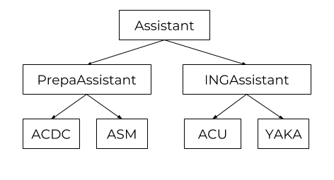

\titlepage

## Overview
\tableofcontents

# Introduction

## C# characteristics

> - Multi-paradigm (mostly object oriented)
> - Strong typing
> - Developped by Microsoft
> - Strongly inspired by Java and C++

## Code example

### Java Hello World
```java
public class HelloWorld {
  public static void main(String[] args) {
    System.out.println("Hello world!");
  }
}
```

### C# Hello World
```cs
using System;

public class HelloWorld {
  public static void Main() {
    Console.WriteLine("Hello World!");
  }
}
```

## Name

> - Originally named `Cool` (C-like Object Oriented Language)
> - Musical notation: semitone higher in pitch
> - `C` => `C++` => `C++++`

## Compilation 101

> - The computer works only with 0 and 1 (Machine language)
> - We need to translate our source code into machine language
> - This is called **compilation**
> - Compiler: program of translation
> - Called once for many executions

## Compilation 101


## C# Compilation


## .NET

> - Developed by Microsoft
> - Software Framework
> - Includes large class library (FCL)
> - Language interoperability
> - Open sources

# Syntax

## Types initialization

> - Undeclared
> - `<type> <name>;`
> - Declared but still uninitialized
> - `<name> = <value>;`
> - Initialized

## Types initialization

> - Undeclared
> - `<type> <name> = <value>;`
> - Initialized

## Arrays

```cs
<type>[] <name>;
<type>[] <name> = <variable>;
<type>[] <name> = new <type>[size];
```

## Initialization - Examples

```cs
char dab = '\t';
int theAnswer = 42;
float goldRatio = 1.6180f;
string deadLine = "These violent deadlines have
                   violent ends";
bool youAreCheaters = true;

int[] randomArray = new int[10];
int[] fibonacci = { 0, 1, 1, 2, 3, 5, 8, 13, 21 };
```

## Operators

> - `+(=)`
> - `++`
> - `-(=)`
> - `--`
> - `*(=)`
> - `/(=)`
> - `%(=)`

## Comparison operators

> - `==`
> - `!=`
> - `<(=)`
> - `>(=)`

## Examples

```cs
int theAnswer = 2 * 4 + 2;
// theAnswer = 10
theAnswer *= 4;
// theAnswer = 40
theAnswer += 2;
// theAnswer = 42
bool isTheAnswer = theAnswer == 42;
// isTheAnswer = true
bool isEven = theAnswer % 2 == 0;
// isEven = true
```

## Logical operators

> - `&&`
> - `||`

## Bitwise operators

> - '!'
> - `&(=)`
> - `|(=)`
> - `^(=)`
> - `<<(=)`
> - `>>(=)`

## Exemples

```cs
int[] fibonacci = { 0, 1, 1, 2, 3, 5, 8, 13, 21 };
// fibonacci = { 0, 1, 1, 2, 3, 5, 8, 13, 21 }
bool randomTest = (fibonacci[2] + fibonacci[5]) == 6
                  && fibonacci[0] == fibonacci[1];
// randomTest = false
int pow_two = 1;
// base 2 : pow_two = 000000001
// pow_two = 1
pow_two <<= 6;
// base 2 : pow_two = 001000000
// pow_two = 64
pow_two ^= 96;
// base 2 : pow_two = 000100000
// pow_two = 32
```

## Warning !

```cs
int foo = 6;
int bar = foo;
bar = 25
```
> - What is the value of foo ?
> - 6

## Warning !

```cs
int[] foo = { 20, 20 };
int[] bar = foo;
bar[0] = 19;
foo[1] = 97;
```

> - What is the value of foo ?
> - { 19, 97 }

## Functions

```cs
<type> <functionName>(<type1> <argName1>, <type2> <argName2>,
                      ...)
{
  //Do things
  return <value of type <type>>
}
```

## Functions - Examples

```cs
string bridge()
{
  return "You fools !";
}

void happyBirthday(string name, int age)
{
  Console.WriteLine("Happy Birthday " + name +
                    " ! You are " + age + " years old now !");
}
```

> - Why happyBirthDay has void as a return type ?
> - It writes the string into the console.

## Functions calls

```cs
string fly = bridge();
// fly = "You fools !"
happyBirthday("Cyril", 22);
Happy Birthday Cyril ! You are 22 years old now !"
```

## Arguments passed by reference

```cs
<type> <functionName>(ref <type1> <argName1>,
                      ref <type2> <argName2>, ...)
{
  //Do things
  return <value of type <type>>
}
```

## Arguments passed by reference - Examples

```cs
void setValue(ref int x, int y, int i, int j)
{
  x = i;
  y = j;
}
```

> - What will be the value inside and outside the function ?

## Functions calls

```cs
int x = 0;
int y = 0;
setValue(ref x, y, 36, 30);
setValue(ref x, 30, 36, y);
setValue(ref 10, 14, 36, 30);
```

> - What is the value of x and y after the first call ?
> - x = 36 and y = 0
> - What is the value of x and y after the second call ?
> - x = 36 and y = 0
> - What is the value of x and y after the third call ?
> - There is an error

# Questions ?

# Imperative programming

## What is imperative?

> - You do what I want
> - Do my exam
> - If I'm tired make me sleep
> - While I sleep clean my dishes

## Control structures - if

```cs
if (<condition1>)
{
  // <condition1> is true
}
else if (<condition2>) // Optional
{
  // <condition1> is false and <condition2> is true
}
else // Optional
{
  // <condition1> and <condition2> are false
}
```

## Examples - if

```cs
int promo = ...;
bool acdcu = ...;
if (promo == 2020 && acdcu)
{
  Console.WriteLine("Hi ! I'm Ferdinand !");
}
else if (promo == 2020 && !acdcu)
{
  Console.WriteLine("Hello ! I'm your ACDC !");
}
else
{
  Console.WriteLine("I'm still too young :'( !");
}
```

## Control structures - ternary

```cs
<condition1> ? /* condition1 is true */
             : /* condition1 is false*/;
```

> - ? is the if
> - : is the else
> - How can we do a if else \<condition2> ?
> -   \<condition1> ? /* \<condition1> is true*/
                        : \<condition2> ? /* <condition1> is
                        false and <condition2> is true */
                        : /* <contition1> and <condition2>
                        are false*/;
> - usefull to shorten your code

## Examples - ternary

```cs
int n = ...;
int abs = n >= 0 ? n : 0;
```

> - What is the value of abs ?
> - if n is negative abs is null else it's n

## Control structures - switch

```cs
switch (<variable>)
{
  case <case1>:
    // <variable> == <case1>
    break;
  case <case2>:
    // <variable> == <case2>
    break;
  case :
    // <variable> is does not match to <case1> or <case2>
    break;
}
```

## Examples - switch

```cs
string girl_name = ...;
switch (name)
{
  case "no name":
    Console.WriteLine("A girl has no name");
    break;
  case :
    Console.WriteLine("You are not ready " + name);
    break;
}
```

## Control structures - while & do while

```cs
while (<condition>)
{
  // loop until <condition> is false
}

do {
  // do this then test the condition
  // and loop if <condition> is true
} while (<condition>);
```

## Examples - while & do while

```cs
bool found_charlie = false;
while (!found_charlie)
{
  Console.WriteLine("Where is Charlie ?");
  found_charlie = find_location();
}
Console.WriteLine("Yes ! Charlie is in the kitchen !");
```

## Examples - while & do while

```cs
bool found_charlie = false;
do {
  Console.WriteLine("Where is Charlie ?");
  found_charlie = find_location();
} while (!found_charlie);
Console.WriteLine("Yes ! Charlie is in the kitchen !");
```

> - What is the difference between the two loops ?
> - While test first the condition wheras
    do while first execute body

## Control structures - for

```cs
for (<initial>; <condition>; <instruction>)
{
  // loop until <condition> is false
  // and execute <instruction> after a loop
}
```

## Examples - for

```cs
int n = 0;
for (int i = 0; i < 100; ++i)
{
  n += i;
}
// n = 5050
```

## Control structures - foreach

```cs
foreach (<type> <name> in <collection>)
{
  // loop in the entire <collection>
}
```

## Examples - foreach

```cs
string[] names = { "Inaxys", "CueBrick", "Tetra" };
foreach (string name in names)
{
  Console.WriteLine(name + " is in the place !");
}
```

> - Can we modify the variable in a foreach loop ?
> - Never do this

## Questions ?

# Object Oriented Programming

## What is OOP?

> - A solution to a problem
> - A concept
> - Patterns
> - Create 'objects' from the patterns

## A class

```cs
class ACDC
{
  //fields
  float height;
  float weight;
  bool isMean;
  [...]
}
```

## A class with methods

```cs
class Student
{
  // fields
  string name;
  float height;
  float weight;
  bool isMean;
  Color hairColor;

  // methods
  string GetName();
  void GoToClass();
  bool IsInClass();
  void Work();
}
```

## Example of using methods

```cs
public static void Main(string[] args)
{
  Student student = new Student();

  if (! student.IsInClass())
    student.GoToClass();
  else
    student.Work();
}
```

## Instantiating an object

* Instantiating is 'creating'
* the keyword: **new**
* the class constructor: a special method

## Constructor

* what is it?
* instanciate an object
* you can have several constructor per class
* there is a default one if none is given
* initialize the fields

## Example

```cs
class ACDC
{
  // fields
  string name;
  int height;
  int age;
  [...]

  // method
  void AnswerQuestion();
  void Facepalm();
  [...]
}
```

## Example
```cs
class ACDC
{
  public ACDC()
  {
    this.name = "Cyril";
    this.height = 180;
    this.age = 2;
  }

  public ACDC(string name, int height, int age)
  {
    this.name = name;
    this.height = height;
    this.age = age;
  }
}
```

## Example

```cs
public static void Main(string[] args)
{
  ACDC inaxys = new ACDC();
  ACDC cuebrick = new ACDC("Cuebrick", 280, 20);

  inaxys.GetAge(); // returns 2
  cuebrick.GetAge(); // return 20
}
```

## Static fields

* Common to every instance of a class
* Cannot be accessed from instance
* Cannot be accessed with **this**.

## Example

```cs
class ACDC
{
  public static int count;
  public ACDC()
  {
    ++count;
  }

  [...]
}
```

## Example

```cs
public static void Main(string[] args)
{
  ACDC garage = new ACDC();
  ACDC kirzie = new ACDC();

  ACDC.count; // count = 2;
}
```

##  Static Class

> - Cannot be instantiated
> - Every field is static

## Example

```cs
static class MY_MATH
{
  // every method is static
  static int Power(int a, int b);
  [...]
}

public static main(string[] args)
{
  MY_MATH.Power(2, 2); // = 4
}
```

# Visibility

# Scope visibility

## Visibility

```cs
if (name == "Inaxys" || name == "Tetra")
{
  int awesomeness = 9001; // Over 9000

  Console.WriteLine("Awesomeness: " + awesomeness);
}
Console.WriteLine("Awesomeness: " + awesomeness);
```

> - What will be written in the console ?
> - **It won't even compile !**

## What is a scope

> - A scope is a block of code
> - Nested with brackets `{ }`
> - Everything you create within a scope is not visible outside

# Class members visibility

## The problem

```cs
public class ACDC {
  public string _name;
  public string _tshirt_name;
  public string _intranet_password;

  public ACDC(string name, string passwd) {
    this._name = name;
    this._string_name = name;
    this._intranet_password = passwd;
  }
}
```

> - We want `_name` and `_thsirt_name` to be equal at any time
> - If someone modify `_name`, `_tshirt_name` will not be updated
> - We do not want another class to see what's in `_intranet_password`
> - Solution: visibility attributes

## Visibility attributes

> - Three keywords: `public`, `private`, `protected`
> - Define the visibility of an attribute, a method or a class
> - Before the type in declaration

## Back to the problem

```cs
public class ACDC {
  private string _name;
  private string _tshirt_name;
  private string _intranet_password;

  public ACDC(string name, string passwd) {
    this._name = name;
    this._string_name = name;
    this._intranet_password = passwd;
  }

  public AskKindlyToChangeName(string new_name) {
    this._name = new_name;
    this._tshirt_name = new_name;
  }
}
```

# Inheritance

## The Problem

> - Suppose we want to write a class ASM
> - It has to share properties with the class ACDC
> - It also has to implement its own new properties
> - Repetitive code...
> - That's why inheritance exists

## Concept

> - Classes can inherit properties of other classes
> - The class that inherits is called "Child class"
> - The class from which the "Child class" inherits is called "Parent class"
> - Child classes can implement additionnal properties
> - Allows us to create a tree with our classes

## Visual example



## In Code

Generic Assisstant class
```cs
class Assistant
{
  private string _name;
  private Color  _tshirt_color;

  public Assistant(string name, Color tshirt_color)
  {
    this._name = name;
    this._tshirt_color = tshirt_color;
  }
}
```

## In Code

ACDC Class
```cs
class ACDC : Assistant // Inherits from Assisstant
{
  private int _caml_skills;

  public ACDC(string name, int skills):
         base(name, Color.Brown) // Assisstant constructor
  {
    /* No need to initialize _nickname and _tshirt_color */
    this._caml_skills = skills;
  }

  public void TeachCAML() {
    /* CAML magic */
  }
}
```

## In Code

ASM Class
```cs
class ASM : Assisstant /* Also inherits from Assisstant */
{
  private bool _emacs_lover;

  public ASM(string name, bool emacs):
         base(name, Color.Grey) // Assisstant constructor
  {
    /* No need to initialize _nickname and _tshirt_color */
    this._emacs_lover = emacs;
  }

  public void TeachC99() {
    /* Marwan's magic */
  }
}
```

# Advanced C#

## Keywords

* `var`
* `typeof`
* and a lot more (`yield`, `explicit`, `try`, `unsafe`, `using`)

## var

```cs
ACDC acdc = new ACDC();
// is the same thing as
var acdc = new ACDC();
```

## var and null

```cs
var tetra = new ACDC();
tetra = null;

ACDC tetra = new ACDC();
tetra = null;

var tetra = null; // compilation failed
```

## typeof

* Get the `System.Type` of a type
* Usually used with the `GetType` method

## Example

```cs
Human people = new Human[42];
[...]

foreach(Human person in people)
{
  Type type = person.GetType();
  if (type.Equals(typeof(ACDC))
    person.AnswerQuestion()
  else
    person.Sleep();
}
```

## Namespace

* Scopes where a set of related classes is implemented.
* Namespaces may nest, sub-namespaces are accessed using ..
* Namespaces use visibility. One can declared a class as private (only accessible in the current namespace) or public (accessible from anywhere).

## Example

```cs
Schools.Ionis.Epita.Students.best.ING1.best.ACDC inaxys = new Schools.Ionis.Epita.Students.best.ING1.best.ACDC();

inaxys.Sings("Best acdc rpz!");
```

## Exampe with namespace

```cs
using Schools.Ionis.Epita.Students.best.ING1.best.ACDC;

ACDC inaxys = new ACDC();
inaxys.Screams("This is SPARTAAAAAAAAAAAAAAAA");
```

## Operator overloading

* you can define opertors between classes (or types in general)
* In other words, you can use `+`, `-`, `*`, `/`, etc.

## Example

```cs
class Human
{
  Color skin;
  Color eyes;

  // Constructor
  [...]

  public static Human operator +(Human a, Human b)
  {
    return new Human(mix(a.skin, b.skin), mix(a.eyes, b,eyes));
  }
}
```

## Example

```cs
Human daddy = new Human(white, green);
Human mommy = new Human(black, brown);

Human baby = daddy + mommy; // metis and brown eyes, ofc
```

## Exceptions

* Manage errors
* Allows to create custom errors (new classes in fact)
* `Execption` is a class

## Throw

* Allows to send an exception

```cs
//blabla

throw new Exception("Flag Trish");

//blabla
```

## Try-Catch

```cs
public statuc void Main()
{
  try
  {
    int t = Convert.toInt32("42");
    // int t = Convert.toInt32("Phorty-twoh");
  } catch (Exception e) {
    Console.Error.WriteLine("You shall not pass!!:" + e.message);
  }
}

// 42 will work fine
// second will 'catch the exception'
```

## Generics

* Define type-safe data structures
* avoid code duplication

## Example

```cs
public class Stack<T>
{
  private T val;
  private Stack<T> next;

  /* equivalent to Push */
  public Stack<T>(T val, Stack<T> stack)
  {
    this.val = val;
    this.next = stack;
  }

  // ...
```

## Example

```cs
// ...

  public T Peek()
  {
    return val;
  }

  public Stack<T> Pop()
  {
    return next;
  }
}
```

## Example

```cs
Stack<int> stack = null;

for (int i = 0; i < 7; ++i)
  stack = new Stack<int>(i, stack);
// stack = 6 -> 5 -> 4 -> 3 -> 2 -> 1 -> 0 -> null

int four = stack.Pop().Pop().Peek();

Stack<int> tail = stack.Pop();
```

## Example

```cs
Stack<ACDC> stack = null;

foreach(var acdc in acdcs)
  stack = new Stack<ACDC>(acdc, stack);
// stack = inaxys -> chokapeek -> treta
//-> CueBrick -> Garage -> Kirzkjdnsie -> null

double four = stack.Pop().Pop().Peek();

Stack<ACDC> tail = stack.Pop();
```

## SURPRISE OCAML

* you thought it would go away?
* Ha, NEVER!

## Functionnal programming

* Function type (create functions)
* Function values (assign functions)
* Function arithmetic (add or substract functions)

## Func, Predicate, Action

```cs
Func<double, double> f = Math.Exp;
double e = f(1);

/* Func<string, void> act ... */
Action<string> act = Console.WriteLine;

/* Func<string, string, bool> p ... */
Predicate<string, string> p = String.Equals;
string str = "So cool";

if (p(str, "it is cool"))
  act("Stylai");
```

## Delegates, lambas and anonymous

```cs
Func<int, int> MultAnswer
= delegate(int x) { return 42 * n; };

// is equivalent to

Func<int, int> MultAnswer = n => 42 * n;

int answer = MultAnswer(1);
// answer = 42
```

## 1 + 1 = a birdplane

```cs
Action<string> hello =
  str => Console.WriteLine("Hello {0}!", str);

Action<string> bye =
  str => Console.WriteLine("Bye {0}…", str);

Action<string> greetings = hello + bye;

greetings("All");
// Hello All!
// Bye All

(greetings - hello)("All");
// Bye All
```

## Questions
